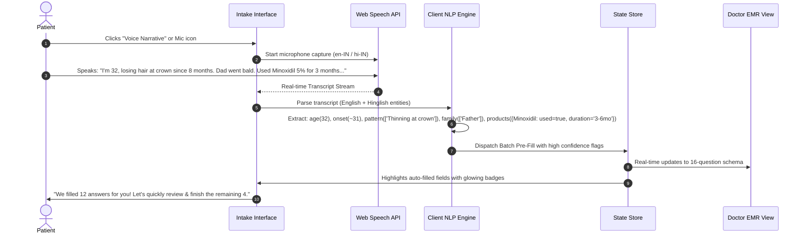
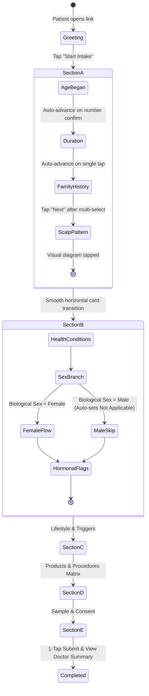
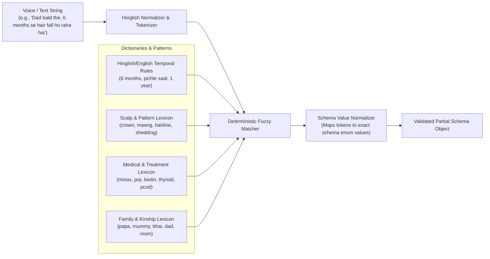

# System Architecture & Workflow Specification: GenoRoot Intake

A comprehensive breakdown of the system architecture, state machines, inference engines, multimodal pipelines, and clinical workflows for the **GenoRoot Hair & Scalp Intake** application.

---

## 1. High-Level System Architecture

```mermaid
graph TB
    subgraph Input Layer ["1. Multimodal Patient Input Layer"]
        A1["Voice Narrative (Web Speech API / Dictation)"]
        A2["Tap-First Stepper (Tailored Micro-Interactions)"]
        A3["Smart Visual Scalp Selector (Norwood/Ludwig)"]
        A4["1-Click Test Persona Injector (Rahul, Priya, Vikram)"]
    end

    subgraph Processing Engine ["2. Client-Side Intelligence & Inference Engine"]
        B1["NLP / Hinglish Entity Extractor<br/>(Fuzzy Intent + Token Parser + RegEx Dict)"]
        B2["Dynamic Skip-Logic & Dependency Graph<br/>(Sex-aware routing, Mutual exclusivity)"]
        B3["Smart Inference Engine<br/>(Age calculation, Treatment cascade, Auto-fill)"]
        B4["Clinical Risk Scorer & SOAP Note Generator<br/>(TE index, AGA pattern, Red flags)"]
    end

    subgraph State Management ["3. Unified State & Validation Layer"]
        C1["Intake State Context (16 Questions + Metadata)"]
        C2["Schema Validation Engine (intake-schema.json compliant)"]
        C3["History & Undo/Redo Timeline"]
    end

    subgraph Output Layer ["4. Real-Time Dual View & Export"]
        D1["Patient UX Viewport (Snappy, Warm Aesthetic, Responsive)"]
        D2["Doctor's EMR View (Live Clinical Summary, SOAP Note)"]
        D3["Structured Data Export (JSON Download, Copy, Print PDF)"]
    end

    Input Layer --> Processing Engine
    Processing Engine --> State Management
    State Management --> Output Layer
```

---

## 2. Complete Question Dependency & Inference Graph

The 16 questions are organized across 5 clinical sections with intelligent cross-field relationships:

```mermaid
flowchart TD
    Start(["Patient Enters Intake"]) --> Welcome["0. Welcome & Profile Card<br/>(Name, Age, Biological Sex)"]

    Welcome --> S_Check{"Biological Sex?"}
    S_Check -- Male --> SkipB["Auto-fill Q6 & Q7 = 'Not applicable'<br/>(Hide female-only questions)"]
    S_Check -- Female --> ShowB["Display Q6 (Menstrual) & Q7 (Pregnancy)"]

    SkipB --> Q1["Q1. Age hair loss began"]
    ShowB --> Q1

    Q1 --> CalcDur["Inference Rule: (Current Age - Age Began)<br/>Pre-selects Q2 Duration"]
    CalcDur --> Q2["Q2. Duration ( <6m / 6-12m / >1yr )"]

    Q2 --> Q3["Q3. Family History (Multi)<br/>Selecting 'None' clears others; Selecting relatives clears 'None'"]
    Q3 --> Q4["Q4. Hair Loss Pattern (Visual Norwood/Ludwig Cards)"]

    Q4 --> Q5["Q5. Diagnosed Conditions (PCOS, Thyroid, Anemia, etc.)"]
    
    Q5 --> CheckSex2{"Female Patient?"}
    CheckSex2 -- Yes --> Q6["Q6. Menstrual Cycle (Regular/Irregular/Menopausal)"]
    Q6 --> Q7["Q7. Pregnancy / Postpartum Status"]
    CheckSex2 -- No --> Q8["Q8. Adult Acne / Oily Skin (Yes/No)"]
    Q7 --> Q8

    Q8 --> Q9["Q9. Excess Facial / Body Hair (Yes/No)"]

    Q9 --> Q10["Q10. Past 6 Months Triggers (Stress, Diet, Surgery, Fever/COVID)"]
    
    Q10 --> Q11["Q11. Lifestyle Habits Table<br/>• Smoking (if Yes -> Severity chips)<br/>• Wash frequency, Hard water, Salon chemicals<br/>• Salon treatments (if Yes -> Keratin, Rebonding chips)"]

    Q11 --> Q12["Q12. Products Table (Shampoo, Minoxidil, Oils, Supplements)<br/>1-Tap Card: If 'Used' -> Show Duration, Helped, Side Effects"]

    Q12 --> Q13["Q13. In-Clinic Procedures (PRP, GFC, Stem Cells, Transplant)<br/>1-Tap Card: If 'Done' -> Show Sessions, Helped"]

    Q13 --> Q14{"Q14. Past Treatment Side Effects"}
    Q12 -- "Any Q12 side_effects = Yes" --> AutoQ14["Auto-sets Q14 = Yes<br/>Pre-populates side-effect prompt"]
    AutoQ14 --> Q14

    Q14 --> Q15["Q15. Preferred Sample Type (Saliva / Blood / Either)"]
    Q15 --> Q16["Q16. Consent to Genetic & Clinical Analysis (Yes/No)"]

    Q16 --> Review(["Final Review & Instant Doctor Handoff"])
```



---

## 3. End-to-End User Workflows

### Workflow A: The "Express Pass" (Voice / Hinglish Narrative Mode)
Ideal for patients who want to speak or write naturally in 30 seconds rather than tapping 16 times.



### Workflow B: Adaptive Step-by-Step Tap Flow
Designed for a 55-year-old on a phone (zero instructions required).



---

## 4. NLP & Hinglish Entity Extraction Architecture

The engine uses a tiered parsing strategy that works **100% locally and instantaneously with zero API keys required**, with an optional LLM connector if desired.



---

## 5. Doctor's Real-time Clinical View & Decision Support Architecture

As the patient fills the intake, the application computes clinical indicators in real-time:

1. **Androgenetic Alopecia (AGA) Genetic Risk Score**:
   - Evaluates paternal, maternal, and sibling lineage flags.
2. **Telogen Effluvium (TE) Trigger Index**:
   - Checks Q10 (COVID/fever, crash dieting, surgery, acute stress within 6 months) + sudden diffuse shedding.
3. **PCOS / Hyperandrogenism Alert**:
   - Triangulates Q5 (PCOS), Q6 (Irregular cycle), Q8 (Adult acne), and Q9 (Hirsutism/excess facial hair).
4. **Treatment Sensitivity & Contraindication Flags**:
   - Warns trichologist if patient had side effects with Minoxidil, Finasteride, or styling chemicals.
5. **Real-time SOAP Note Compiler**:
   - **S (Subjective)**: Patient narrative, onset age, pattern, triggers.
   - **O (Objective/History)**: Family pedigree, prior treatments (PRP sessions, Minoxidil duration).
   - **A (Assessment)**: High probability conditions (e.g. AGA Norwood III vs Telogen Effluvium).
   - **P (Plan Recommended)**: Preferred sample collection (Saliva/Blood), trichoscopy focal points.

---

## 6. Verification & Schema Compliance Matrix

| Section | Question # | Key in `intake-schema.json` | Type | Inferred / Smart Behavior |
|---|---|---|---|---|
| **A** | Q1 | `age_hair_loss_began` | `number` | Number input / quick slider |
| **A** | Q2 | `duration` | `single` | Auto-calculated from Current Age - Q1 |
| **A** | Q3 | `family_history` | `multi` | "No known family history" mutually exclusive |
| **A** | Q4 | `pattern` | `multi` | Visual scalp cards with Norwood/Ludwig diagrams |
| **B** | Q5 | `diagnosed_conditions` | `multi` | "None" mutually exclusive |
| **B** | Q6 | `menstrual_cycle` | `single` | Skipped / Auto-filled `Not applicable` if Male |
| **B** | Q7 | `pregnancy_related` | `single` | Skipped / Auto-filled `Not applicable` if Male |
| **B** | Q8 | `adult_acne_oily_skin` | `yesno` | 1-tap segment |
| **B** | Q9 | `excess_body_facial_hair` | `yesno` | 1-tap segment |
| **C** | Q10 | `past_6_months` | `multi` | Multi-chip selector |
| **C** | Q11 | `habits` | `table` | Conditional followups (Smoking severity, Salon details) |
| **D** | Q12 | `products` | `table` | Card-based progressive disclosure (used/duration/helped/side_effects) |
| **D** | Q13 | `procedures` | `table` | Card-based progressive disclosure (done/sessions/helped) |
| **D** | Q14 | `past_treatment_side_effects` | `yesno + text` | Auto-set to `yes` if Q12 side effects marked |
| **E** | Q15 | `sample_type` | `single` | 1-tap cards: Saliva, Blood, Either |
| **E** | Q16 | `consent` | `yesno` | Legal compliance checkbox/toggle |

---

## 7. Reviewer Experience Features (For the Hiring Team)

To ensure the submission stands out and makes testing effortless:
1. **Persona Quick-Switcher**:
   - *Rahul (32M)*: Classic Norwood III Male Pattern Baldness, father has hair loss, used Minoxidil, smoked <5/day.
   - *Priya (28F)*: Postpartum diffuse shedding, PCOS history, adult acne, sudden shedding post-COVID.
   - *Vikram (55M)*: Long-term hair loss >10 years, PRP done 6 sessions, interested in Hair Transplant & genetic blood test.
2. **Live Side-by-Side Toggle**: Instant switch between "Patient View", "Doctor EMR Summary", and "Raw JSON Schema Validator".
3. **Speed Run Mode**: Test full completion in under 15 seconds.
